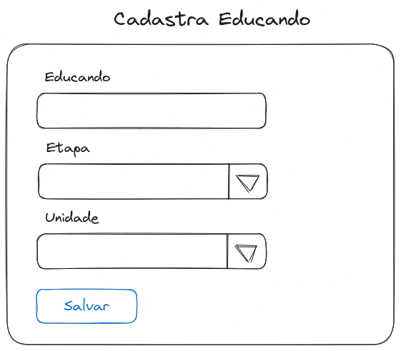
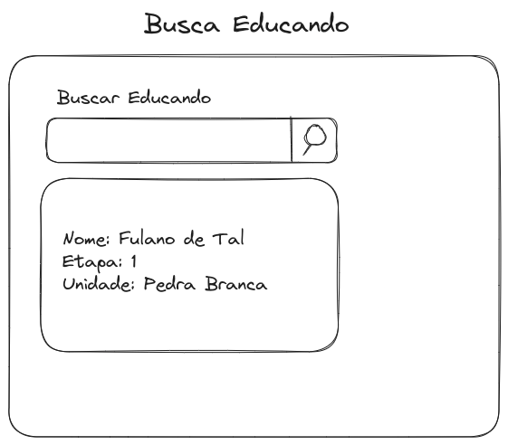
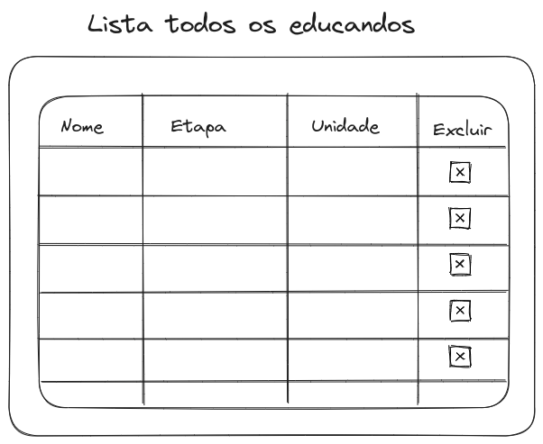

## Objetivo do projeto

O objetivo sdo projeto é criar telas de inclusão, pesquisa e listagem com opção de explusão de registros de educandos do PAQ.

## Estruturas de dados

```sql
EDUCANADO
  ID: int
  NOME: varchar(255)
  ETAPA: ETAPA_ID
  UNIDADE: UNIDADE_ID

ETAPA
  ID: int
  NOME: varchar(255)

UNIDADE
  ID: int
  NOME: varchar(255)
```

## Mockup das telas







---

## Getting Started

Welcome to the VS Code Java world. Here is a guideline to help you get started to write Java code in Visual Studio Code.

## Folder Structure

The workspace contains two folders by default, where:

- `src`: the folder to maintain sources
- `lib`: the folder to maintain dependencies

Meanwhile, the compiled output files will be generated in the `bin` folder by default.

> If you want to customize the folder structure, open `.vscode/settings.json` and update the related settings there.

## Dependency Management

The `JAVA PROJECTS` view allows you to manage your dependencies. More details can be found [here](https://github.com/microsoft/vscode-java-dependency#manage-dependencies).
